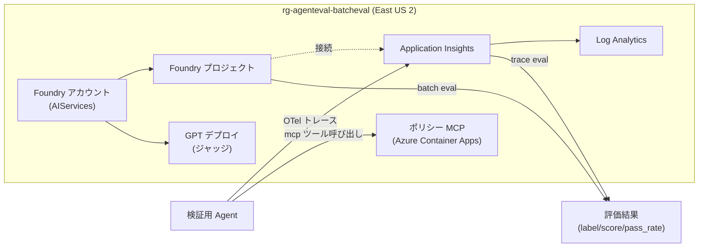

# Agent-EVL

Microsoft Foundry 上の AI エージェントを **評価（Evaluation）** するための検証基盤です。
Azure リソースの構築（Bicep）、検証用エージェントの作成、ポリシー応答用の MCP サーバー、
そして **バッチ評価** と **トレース評価（preview）** の実行コードまでを一式で提供します。

題材は Contoso のカスタマーサポート エージェント（返品・配送・支払い・ポイントのポリシー応答）です。

---

## 📦 リポジトリ構成

```
Agent-EVL/
├── README.md                         # このファイル（このリポジトリの単一ドキュメント）
└── Batch-eval/                       # バッチ評価 / トレース評価 基盤一式
    ├── .env.example
    ├── infra/
    │   ├── main.bicep                # サブスクリプション スコープ（RG 新規作成）
    │   ├── main.bicepparam           # 検証環境パラメーター
    │   └── modules/
    │       └── resources.bicep       # RG スコープ リソース本体
    ├── scripts/
    │   ├── deploy.ps1                # PowerShell デプロイ（Windows 既定）
    │   ├── deploy.sh                 # Bash デプロイ
    │   ├── deploy-mcp.ps1            # ポリシー MCP サーバーを ACA へデプロイ
    │   └── teardown.ps1              # 削除（RG 削除 + Foundry purge / ACA・ACR も含む）
    ├── agent/
    │   └── create_agent.py           # 検証用エージェント作成（MCP ツール付き）+ トレース生成
    ├── mcp/
    │   ├── server.py                 # FastMCP サーバー（streamable-http, 4ツール + APIキー認証）
    │   ├── requirements.txt
    │   ├── Dockerfile                # ACA 用コンテナー定義
    │   ├── smoke_test.py             # MCP クライアント疎通テスト
    │   └── data/
    │       └── policies.json         # ポリシーデータ（決定的応答の元）
    └── eval/
        ├── requirements.txt
        ├── _common.py                # クライアント取得ユーティリティ
        ├── run_batch_eval.py         # データセット バッチ評価
        ├── run_trace_eval.py         # App Insights トレース評価 (preview)
        └── data/
            └── sample-eval.jsonl     # サンプル評価データセット（Contoso）
```

---

## 🎯 何ができるか

| 機能 | 内容 |
|---|---|
| インフラ構築 | Foundry アカウント / プロジェクト、ジャッジ用 GPT デプロイ、App Insights + Log Analytics を Bicep で一括作成 |
| 検証用エージェント | `agent/create_agent.py` で Contoso サポート エージェントを作成。MCP ツールを付与し評価対象トレースを生成 |
| ポリシー MCP | `mcp/server.py`（FastMCP / streamable-http）を Azure Container Apps に公開。返品・配送・支払い・ポイントの 4 ツールを提供 |
| バッチ評価 | データセット（JSONL）に対し `coherence` / `relevance` / `groundedness` / `f1_score` で採点 |
| トレース評価 | App Insights の `invoke_agent` スパンを `task_adherence` / `tool_call_accuracy` で採点（preview） |

---

## 🏗️ アーキテクチャ



---

## ✅ 前提条件

- **Azure CLI** (`az`) — [インストール](https://aka.ms/installazurecli)
- **PowerShell 7+**（`deploy.ps1` 用）または Bash（`deploy.sh` 用）
- **Python 3.10+**
- **MCP デプロイ用**: `az extension add --name containerapp`（`deploy-mcp.ps1` が `az containerapp up --source` でクラウドビルドするため、ローカル Docker は不要）
- リージョンは **East US 2**、Resource Group は `rg-` プレフィックスで新規作成
- 対象サブスクリプションに対する **共同作成者 + ユーザーアクセス管理者**（または Owner）相当の権限（RBAC 付与を伴うため）

> テナント / サブスクリプションは環境変数 `AZURE_TENANT_ID` / `AZURE_SUBSCRIPTION_ID`、
> または現在の `az` ログイン コンテキストから取得します（スクリプトにハードコードしていません）。

---

## 🚀 使い方

### 1. インフラのデプロイ

PowerShell（Windows 既定）:

```powershell
cd Batch-eval\scripts
./deploy.ps1
```

Bash:

```bash
cd Batch-eval/scripts
chmod +x deploy.sh && ./deploy.sh
```

`deploy.ps1` / `deploy.sh` は次を自動実行します:
1. テナント/サブスクリプションへのログイン・設定
2. `infra/main.bicep` のデプロイ（RG・Foundry・モデル・App Insights・接続）
3. RBAC 付与（実行ユーザー → `Foundry User`、プロジェクト MI → `Monitoring Reader` / `Log Analytics Reader`）
4. `eval/.env` の生成

> RBAC をスキップする場合は `./deploy.ps1 -SkipRbac`（または `SKIP_RBAC=true ./deploy.sh`）。

### 2. Python 環境の準備

```powershell
cd ..\eval
python -m venv .venv
.\.venv\Scripts\Activate.ps1
pip install -r requirements.txt
```

### 3. データセット バッチ評価の実行

```powershell
python run_batch_eval.py
```

`data/sample-eval.jsonl` をアップロードし、`coherence` / `relevance` / `groundedness` / `f1_score`
で採点します。完了後、行ごとの `score` / `label` と `report_url` を出力します。

### 4. ポリシー MCP サーバーのデプロイ（Azure Container Apps）

エージェントのプロンプト（返品・配送・支払い・ポイント）に対応した MCP ツールを
Azure Container Apps 上に公開します。

```powershell
cd ..\scripts
./deploy-mcp.ps1
```

`az containerapp up --source` でクラウドビルド＆デプロイし、公開 HTTPS URL と API キーを
生成して `eval/.env` に `CONTOSO_MCP_URL` / `CONTOSO_MCP_KEY` として追記します。
公開ツール: `get_return_policy` / `get_shipping_policy` / `get_payment_policy` / `get_loyalty_points`。
認証はカスタムヘッダー `x-contoso-key`（ASGI ミドルウェアで検証）。

疎通確認:

```powershell
cd ..\mcp
.\.venv\Scripts\python.exe smoke_test.py $env:CONTOSO_MCP_URL $env:CONTOSO_MCP_KEY
```

### 5. 検証用エージェントの作成（MCP ツール付き / トレース生成）

```powershell
cd ..\eval
python ..\agent\create_agent.py
```

`CONTOSO_MCP_URL` / `CONTOSO_MCP_KEY` が設定済みなら、エージェントへ `mcp` ツール
（`server_label=contoso-policy`, `require_approval=never`）を付与した新バージョンを作成します。
出力された `AGENT_ID`（例 `contoso-support-agent:2`）を `eval/.env` の `AGENT_ID` に追記します。

#### 参考質問（動作確認用）

エージェントが「推測せず、必ず MCP ツールを呼び出して回答するか」を確認するための質問例です。
各質問は 4 つのツール（`get_return_policy` / `get_shipping_policy` / `get_payment_policy` /
`get_loyalty_points`）を網羅しています。Foundry のプレイグラウンドや評価データセット
（[`Batch-eval/eval/data/sample-eval.jsonl`](./Batch-eval/eval/data/sample-eval.jsonl)）に流し込んで利用できます。

| # | 質問 | 期待ツール呼び出し | 期待回答の要点 |
|---|---|---|---|
| 1 | 45日前に買った一般カテゴリの商品を返品したいです。全額返金されますか？ | `get_return_policy(category="general", purchased_days_ago=45)` | 30日超過のため全額返金不可、**店舗クレジット**対応。購入証明・未使用が必要 |
| 2 | ダウンロード済みのデジタル商品を返品できますか？ | `get_return_policy(category="digital")` | **返品対象外** |
| 3 | 国内に4,000円の注文をします。送料はいくらかかりますか？ | `get_shipping_policy(destination="domestic", order_amount=4000)` | 5,000円未満のため**送料500円**、目安2〜4営業日 |
| 4 | クレジットカードで分割払いはできますか？返金にかかる日数は？ | `get_payment_policy(method="クレジットカード")` | **最大24回まで分割可**、返金は**5〜10営業日** |
| 5 | 顧客ID C-1002 です。現在のポイント残高と会員ランクを教えてください。 | `get_loyalty_points(customer_id="C-1002")` | 佐藤 花子 / **platinum** / 残高 **8,400ポイント** |

> 堅牢性（ハルシネーション耐性）も確認したい場合:
> - 存在しない顧客ID「C-9999 のポイント残高は？」→ ツールを呼んだ上で「該当顧客なし／確認が必要」と返すか
> - ポリシー外「実店舗の営業時間は？」→ 範囲外として**確認が必要**と伝えるか

### 6. トレース評価（preview）の実行

ingestion 遅延（数分）を待ってから:

```powershell
python run_trace_eval.py
```

App Insights の `invoke_agent` スパンを `task_adherence`（タスク遵守度）と
`tool_call_accuracy`（ツール呼び出し正確性）で採点します。
`tool_call_accuracy` は `query` / `response` / `tool_calls` / `tool_definitions` の
`data_mapping`（traces シナリオでは `{{item.*}}`）が必須で、MCP ツールを持つ本エージェント向けです。

### 7. 後片付け

```powershell
cd ..\scripts
./teardown.ps1
```

---

## 🔧 パラメーターのカスタマイズ

`Batch-eval/infra/main.bicepparam` を編集して変更できます。

| パラメーター | 既定値 | 説明 |
|---|---|---|
| `location` | `eastus2` | リージョン |
| `namePrefix` | `agenteval` | リソース名プレフィックス |
| `resourceGroupName` | `rg-agenteval-batcheval` | Resource Group 名 |
| `judgeModelName` | `gpt-4.1-mini` | ジャッジ用モデル |
| `judgeModelVersion` | `2025-04-14` | モデルバージョン |
| `judgeModelSkuName` | `GlobalStandard` | デプロイ SKU |
| `judgeModelCapacity` | `50` | 容量（1000 TPM 単位） |

---

## 🔐 設定とシークレット

- 実際の設定値は `Batch-eval/eval/.env`（**Git 管理外**）に格納します。雛形は
  [`Batch-eval/.env.example`](./Batch-eval/.env.example) を参照。
- `deploy.ps1` / `deploy-mcp.ps1` が `eval/.env` を自動生成・追記します
  （`PROJECT_ENDPOINT` / `APPLICATIONINSIGHTS_*` / `CONTOSO_MCP_URL` / `CONTOSO_MCP_KEY` など）。
- `_` で始まるフォルダ（`_report` / `_task` 等）は `.gitignore` で除外しています。

---

## 📝 補足・注意

- **`f1_score` と日本語**: 組み込みの `f1_score` は単語（トークン）重なりベースの指標です。
  日本語は空白区切りがないため、回答全体が 1 トークン化されてしまい、参照文と完全一致しない限り
  スコアは 0 になります。日本語データでは AI アシスト評価器（`coherence` / `relevance` /
  `groundedness`）を品質シグナルとして利用してください（`f1_score` は英語データ向けの参考指標）。
- **トレース評価は preview**。ルックバックは最大 7 日（168時間）。ingestion 遅延があるため、
  エージェント呼び出し直後は数分待ってから実行してください。
- **Foundry エンドポイントのホスト名** は account 名ではなく `customSubDomainName`（ハイフン除去・
  小文字化した `${namePrefix}${nameSuffix}`）です。`PROJECT_ENDPOINT` は Bicep 出力
  `projectEndpoint` から自動設定されます（`deploy.ps1` / `deploy.sh`）。手で組み立てないでください。
- **ロール名**: ユーザーに付与するデータ プレーン ロールは `Foundry User` です
  （テナントによっては旧称 "Azure AI User" は存在しません）。
- ジャッジ用モデルは East US 2 で利用可能なものに合わせて調整してください
  （容量不足時はランが長時間 Running になります → ポータルで容量増）。
- Foundry / Cognitive Services はソフトデリート対象です。再作成で名前衝突する場合は
  `teardown.ps1` の purge を利用してください。
- Foundry Agent SDK はバージョンにより API 名が異なる場合があります（本実装は
  `azure-ai-projects` 2.x の `agents.create_version` + Responses API `agent_reference` を使用）。
  エラー時は `pip install -U azure-ai-projects` と
  [公式サンプル](https://github.com/Azure/azure-sdk-for-python/tree/main/sdk/ai/azure-ai-projects/samples)
  を参照してください。

---

## 📚 主要参照元

| タイトル | URL |
|---|---|
| Run evaluations in the cloud (Foundry SDK) | https://learn.microsoft.com/en-us/azure/foundry/how-to/develop/cloud-evaluation |
| Agent evaluators | https://learn.microsoft.com/en-us/azure/foundry/concepts/evaluation-evaluators/agent-evaluators |
| 生成 AI の可観測性 | https://learn.microsoft.com/ja-jp/azure/foundry/concepts/observability |
| OpenTelemetry GenAI semantic conventions | https://opentelemetry.io/docs/specs/semconv/gen-ai/ |

> 設計根拠（一次情報の調査結果）: [`_report/20260614-1600-batch-eval-foundry/final-report.md`](./_report/20260614-1600-batch-eval-foundry/final-report.md)


