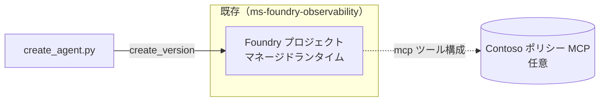

# agent-aif-prompt-agent — Foundry プロンプトエージェント

既存の Microsoft Foundry プロジェクト（[`ms-foundry-observability`](../ms-foundry-observability/) で作成）上に、
Contoso カスタマーサポートの **プロンプトエージェント**を作成する自己完結プロジェクトです。

[プロンプトエージェント](https://learn.microsoft.com/ja-jp/azure/foundry/agents/overview#prompt-agents)は
**指示・モデル・ツール構成だけで完全に定義**され、Foundry がフルマネージドランタイムで実行します。
維持するアプリケーションコードも、支払うコンピュートも、スケーリングや監視のための
コンテナーもありません。**追加の Azure リソース（Cosmos/Storage/Search）も
Capability Host も不要**です。

| 項目 | プロンプトエージェント（本プロジェクト） | ホスト型エージェント |
| --- | --- | --- |
| 定義 | 指示・モデル・ツール構成 | 独自コード（コンテナ/zip） |
| ランタイムコード | なし（フルマネージド） | あり（自分で保守） |
| 追加リソース | 不要 | BYO（Capability Host 等） |
| 用途 | 迅速な立ち上げ・運用エージェント | カスタムオーケストレーション |

> スレッド・ファイル・ベクターストアを **自分の Azure リソース（BYO）** に
> 永続化したい場合は、別途「独自リソースの使用（Standard Agent Setup）」が必要です。
> 本フェーズのプロンプトエージェントでは扱いません。

---

## 構成

```
agent-aif-prompt-agent/
├── agent_config.py          # .env 読み込み + クライアント取得（自己完結）
├── create_agent.py          # プロンプトエージェントの作成のみ（create_version）
├── requirements.txt
├── .env.example
└── scripts/
    └── setup-env.ps1 / .sh  # .env 生成（観測基盤 .env から接続情報を引き継ぎ）
```

### アーキテクチャ



---

## 前提

- [`ms-foundry-observability`](../ms-foundry-observability/) をデプロイ済みで `.env` が生成されている
- Azure CLI（`az`）でログイン済み（プロジェクトの利用権限）
- Python 3.10+

> プロンプトエージェントの作成は既存プロジェクトに対する操作のみで、
> 新規リソース作成や RBAC 付与は不要です。

---

## セットアップ手順

```powershell
# 1. .env 生成（ms-foundry-observability/.env から接続情報を引き継ぎ）
./scripts/setup-env.ps1
#   既存 .env の CONTOSO_MCP_URL / CONTOSO_MCP_KEY は維持されます

# 2. 依存インストール
python -m pip install -r requirements.txt
```

Bash の場合:

```bash
./scripts/setup-env.sh
python -m pip install -r requirements.txt
```

---

## エージェント作成

```powershell
# プロンプトエージェントを作成（既定名: contoso-support-agent）
python create_agent.py

# 名前を指定して作成
python create_agent.py --name my-support-agent
```

### Contoso ポリシー MCP を作成している場合

[`mcp/`](../mcp/) の Contoso ポリシー MCP をデプロイ済みの場合、`.env` に
その接続情報を設定すると、エージェントのツール構成にポリシー MCP ツール
（`get_return_policy` / `get_shipping_policy` /
`get_payment_policy` / `get_loyalty_points`）が含まれます。

```dotenv
# Contoso ポリシー MCP のエンドポイント（末尾に /mcp を付ける）
CONTOSO_MCP_URL=https://<your-app>.azurecontainerapps.io/mcp
CONTOSO_MCP_KEY=<KEY>
```

設定後に `python create_agent.py --name <名前>` で作成（再作成）します。
未設定の場合は MCP ツールなしで作成されます。

---

## 動作確認（テスト用の質問例）

作成後、Foundry ポータルのプレイグラウンドでエージェントを開き、以下のような質問で応答を確認します。
MCP ツールを構成している場合、各質問は対応するポリシーツールを呼び出します。
期待回答は [`mcp/data/policies.json`](../mcp/data/policies.json) の値に基づく具体例です。

| カテゴリ | 質問例 | 呼び出されるツール | 期待する回答（具体例） |
| --- | --- | --- | --- |
| 返品 | 「30 日前に買った衣料品（general）を返品できますか？」 | `get_return_policy` | 「返品可能です。購入から 30 日以内なら全額返金、超過後は店舗クレジットになります（要：購入証明・未使用）」 |
| 返品 | 「ダウンロード済みのデジタル商品は返品できますか？」 | `get_return_policy` | 「ダウンロード済みのデジタル商品は返品対象外です」 |
| 返品 | 「食品（perishable）は返金対象になりますか？」 | `get_return_policy` | 「食品など生鮮・消耗品は衛生上の理由で返品対象外です」 |
| 配送 | 「8,000 円の注文を国内に送る場合、送料はいくらですか？」 | `get_shipping_policy` | 「5,000 円以上のため送料無料です（標準 2〜4 営業日）」 |
| 配送 | 「3,000 円の国内注文の送料と、お急ぎ便の料金は？」 | `get_shipping_policy` | 「標準送料 500 円（2〜4 営業日）、お急ぎ便は 1,200 円（翌営業日）」 |
| 配送 | 「海外発送は対応していますか？日数の目安は？」 | `get_shipping_policy` | 「対応しています。基本送料 2,000 円、目安 7〜14 営業日（関税・追加日数が発生する場合あり）」 |
| 支払い | 「クレジットカードで分割払いはできますか？」 | `get_payment_policy` | 「クレジットカードは最大 24 回まで分割可能です（他の支払い方法は一括のみ）」 |
| 支払い | 「クレジットカードの返金は何日かかりますか？」 | `get_payment_policy` | 「クレジットカードへの返金は 5〜10 営業日です（元の支払い方法へ返金）」 |
| ポイント | 「ポイントの付与率と有効期限を教えてください」 | `get_loyalty_points` | 「100 円ごとに 1 ポイント付与、1 ポイント = 1 円。最終の獲得・利用から 12 か月で失効します」 |
| ポイント | 「顧客ID C-1001 の現在のポイント残高は？」 | `get_loyalty_points` | 「山田 太郎 さん（gold 会員）の残高は 1,250 ポイントです」 |
| 複合 | 「20 日前に買った家電（general）を返品したいです。クレジットカードでの返金日数も教えて」 | `get_return_policy` + `get_payment_policy` | 「30 日以内なので全額返金が可能です。クレジットカードへの返金は 5〜10 営業日かかります」 |

> MCP は決定的（同じ入力に同じ出力）なので、回答が上記の期待値と一致するかで疎通・正答性を判断できます。
> 既存の顧客ID は `C-1001`（gold/1,250pt）・`C-1002`（platinum/8,400pt）・`C-1003`（regular/320pt）です。

> MCP ツール未構成の場合は、エージェントの指示（システムプロンプト）に基づいた一般的な回答になります。
> 決定的なポリシー応答を確認するには `CONTOSO_MCP_URL` / `CONTOSO_MCP_KEY` を設定して作成してください。

---

## 後始末

プロンプトエージェントは追加リソースを作らないため、削除すべきインフラはありません。
不要になったエージェントは Foundry ポータル、または SDK（バージョン削除）で削除できます。
